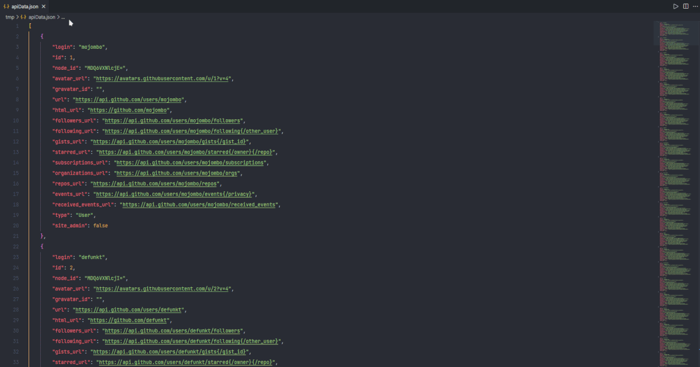

# JSON to Go

## This extension will let you convert JSON data from editor selection or clipboard to a go type definition.

It can be run through the command pallete or the right mouse button context menu. Context menu is shown inside editor for configured languages.  
Upon execution a temporary file will be opened and struct name will automatically be selected for easy renaming.



### Settings

#### Context menu

You can choose inside which languages to show the context menu with the following setting.  
Include `"*"` if you want the context menu to always be shown.
Default values are below.

```json
"json-to-go.contextMenu.supportedLanguages": [
        "javascript",
        "typescript",
        "json",
        "jsonc",
        "html",
        "go"
    ]
```

#### Inline type definitions

The checkbox allows you to generate nested types as inline structs:

```go
type Autogenerated struct {
	Employees []struct {
		Name string `json:"name"`
		Email string `json:"email"`
	} `json:"employees"`
}
```

Or below the main struct:

```go
type Autogenerated struct {
	Employees []Employee `json:"employees"`
}
type Employee struct {
	Name string `json:"name"`
	Email string `json:"email"`
}
```

### Input source

Here you can choose the source of the JSON data.  
If setting is ask me every time, you will be asked on every run of the command.  
Also you will be asked to remember your choice, unless you select `No and don't ask again' in which case you will never be asked again to save your choice.

All credits for the original json-to-go belong to [mholt](https://github.com/mholt/)
